<h3 align="center">Hello, I'm Harshit Sharma</h3>

B.Tech CSE Student · C/C++ · Python · DSA · Backend Development

  
  
  

---

## About Me

-  B.Tech CSE Student
-  Currently strengthening **Data Structures & Algorithms** and **Backend Development**
-  Sharpening problem-solving on LeetCode
-  Building real-world projects from scratch
-  Always open to collaborating on interesting projects

---

## Skills

### Languages

  

### Frameworks & Databases

  

### Tools

  

---

  Thanks for stopping by ✨

